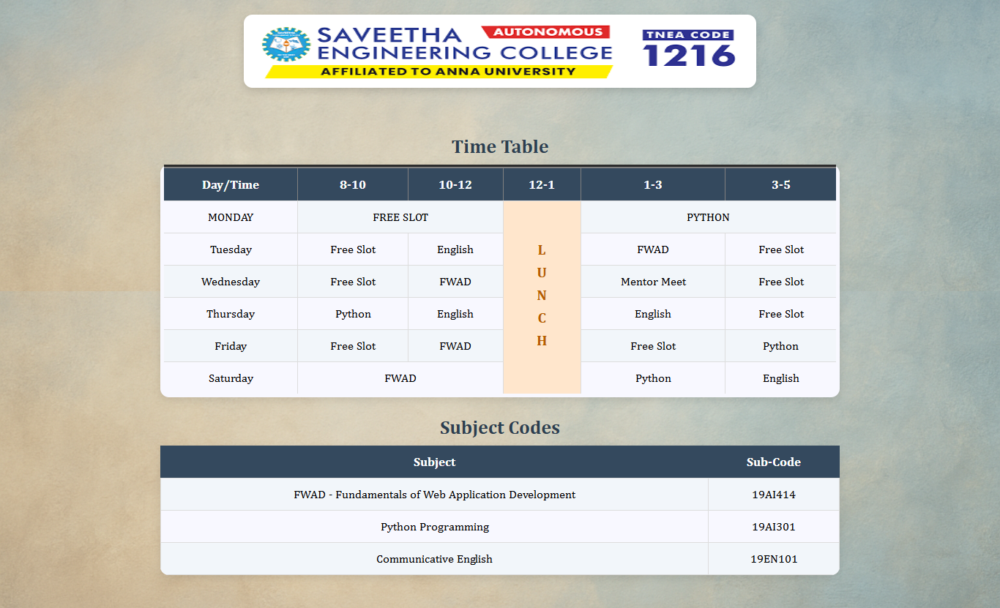

# Ex03 Time Table
# Date:28.11.2025
# AIM
To write a html webpage page to display your slot timetable.

# ALGORITHM
## STEP 1
Create a Django-admin Interface.

## STEP 2
Create a static folder and inert HTML code.

## STEP 3
Create a simple table using `<table>` tag in html.

## STEP 4
Add header row using `<th>` tag.

## STEP 5
Add your timetable using `<td>` tag.

## STEP 6
Execute the program using runserver command.

# PROGRAM
views.py
```
def slot(request):
    return render(request,'slot.html')
```

urls.py    
```
from Django.contrib import admin
from Django.urls import path
from slotapp import views
urlpatterns = [
    path('admin/', admin.site.urls),
    path('tt/', views.slot)
]
```
html
```
<!DOCTYPE html>
<html lang="en">

<head>
    <title>Time Table</title>
    <style>
        body {
            font-family: "Cambria", serif;
            margin: 0;
            padding: 20px;
            background-image: url("/static/bgimg.png");
            background-size: cover;
            background-repeat: no-repeat;
            background-position: center;
            background-attachment: fixed;
        }

        img {
            display: block;
            margin: 0 auto 20px;
            border-radius: 12px;
            box-shadow: 0 4px 12px rgba(0, 0, 0, 0.15);

        }


        table {
            width: 70%;
            height: 30%;
            margin: 25px auto;
            border-collapse: collapse;
            background: ghostwhite;
            border-radius: 12px;
            overflow: hidden;
            box-shadow: 0 4px 12px rgba(0, 0, 0, 0.1);
        }

        caption {
            font-size: 26px;
            margin-bottom: 10px;
            font-weight: bold;
            color: #2c3e50;
        }

        th {
            background: #34495e;
            color: white;
            padding: 12px;
            font-size: 17px;
        }

        td {
            padding: 12px;
            border: 1px solid #ddd;
            text-align: center;
            font-size: 16px;
        }

        tr:nth-child(even) td {
            background: #f2f6fa;
        }

        tr:hover td {
            background: #eaf2ff;
            transition: 0.2s;
        }

        .lunch {
            writing-mode: vertical-rl;
            text-orientation: upright;
            font-weight: bold;
            background: #ffe6cc !important;
            color: #b85c00;
            font-size: 20px;
            letter-spacing: 8px;
            /* spacing between letters */
            text-align: center;
        }
    </style>
</head>

<body>
    <center>
        
    </center>
    <br>
    <table align="center" width="540" cellspacing="2" cellpadding="4" border="5" bgcolor="blue">
        <caption>Time Table</caption>
        <tr>
            <th>Day/Time</th>
            <th>8-10</th>
            <th>10-12</th>
            <th>12-1</th>
            <th>1-3</th>
            <th>3-5</th>
        </tr>

        <tr>
            <td style="background-color: ghostwhite;">MONDAY</td>
            <td colspan="2">FREE SLOT</td>
            <td rowspan="6" class="lunch"><span>LUNCH</span></td>
            <td colspan="2">PYTHON</td>

        </tr>

        <tr>
            <td>Tuesday</td>
            <td>Free Slot</td>
            <td>English</td>
            <td>FWAD</td>
            <td>Free Slot</td>
        </tr>

        <tr>
            <td>Wednesday</td>
            <td>Free Slot</td>
            <td>FWAD</td>
            <td>Mentor Meet</td>
            <td>Free Slot</td>
        </tr>

        <tr>
            <td>Thursday</td>
            <td>Python</td>
            <td>English</td>
            <td>English</td>
            <td>Free Slot</td>
        </tr>

        <tr>
            <td>Friday</td>
            <td>Free Slot</td>
            <td>FWAD</td>
            <td>Free Slot</td>
            <td>Python</td>
        </tr>

        <tr>
            <td>Saturday</td>
            <td colspan="2">FWAD</td>
            <td>Python</td>
            <td>English</td>
        </tr>

    </table>
    <table>
        <caption>Subject Codes</caption>

        <tr>
            <th>Subject</th>
            <th>Sub-Code</th>
        </tr>

        <tr>
            <td>FWAD - Fundamentals of Web Application Development</td>
            <td>19AI414</td>
        </tr>

        <tr>
            <td>Python Programming</td>
            <td>19AI301</td>
        </tr>

        <tr>
            <td>Communicative English</td>
            <td>19EN101</td>
        </tr>
    </table>

</body>

</html>
```
# OUTPUT

# RESULT
The program for creating slot timetable using basic HTML tags is executed successfully.
